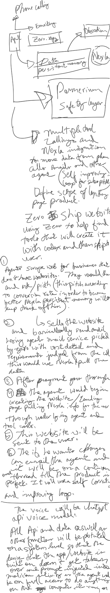
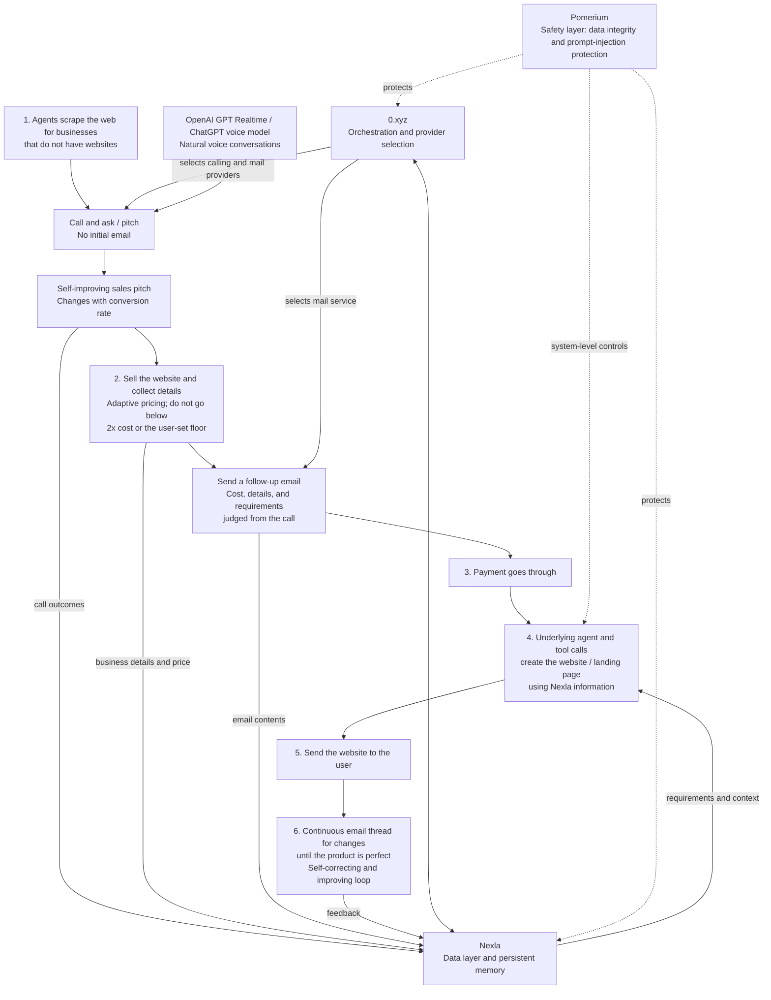

# BuildStax: Agentic Website Sales and Delivery System

**Sources consolidated:** the 14:35 audio recording, supplied pasted transcript, and handwritten flowchart. Proper names and obvious transcription errors have been corrected. Brief overlapping or unintelligible speech is marked instead of guessed.

## Handwritten Flowchart

## Searchable Flowchart Recreation

## Cleaned Transcript

Oh, what else? What is the coordinator? Okay, yeah.

So we'll have phone calling and emailing, with our agent at the center, right?

Agent, yeah. Now, what our agent is going to do is access both phone calling and emailing through 0.xyz, right? Any provider, but 0-based: whatever provider 0 gives us, the best provider, we'll use that for phone calling and emailing.

If you don't find the space here, there's lots of space. Then next, we'll have Nexla. There's another full area there with desks and sofas and everything.

Yes, so we're going to have Nexla, right? The product Nexla as our data layer. So this would be data, and this would be persistent memory, right? Because we can use this as our Supermemory or whatever. It's a similar service we'll use through Nexla, right? We'll use maybe Obsidian, whatever is free, whatever is cheap, whatever works through the system.

Yeah, whatever is our 0.xyz experience, basically.

No, this would be Nexla, though, because the data layer will keep on Nexla. 0.xyz is going to connect everything together, including the Nexla system. And what we're going to end up doing is use the base with the security system to make sure all the data is transposing correctly, right? And there's no, like, prompt injection.

For safety measures, we can use, what is it called? Pomerium. P-O-M-E-R-I-U-M. Pomerium. That's going to be the safety layer, right? I feel that's good.

Now, product scope. Are we still going to stick to the agentic call-service system?

Email also. Email and calling. Email will be the follow-up email. Calling is the first time you contact the business.

Yes. Yeah. I don't understand. I think we should make this from scratch. Does that work, right?

Well, not exactly. We have these things. [Brief overlapping discussion.] We can use the base that we have right now, but with 0 instead. Yeah.

Okay, so this is going to be our base layer, right? And then what we're going to end up doing is use multiple tool calls and the Nexla integration to move data from the phone calls, emails, and other agent communications. The sales pitch is going to be always changing, right? It's going to be improving: a self-improving loop for the sales pitch.

Okay. So, yeah, the agents are going to be a self-improving loop, and all these things are going to be connected through 0. What's going to end up happening is we're also going to use the 0 and Nexla integration to move data from the emails and agents and all the sales calls in order to basically define the scope of the landing page and product.

[Brief unrelated exchange, partly unclear.] Oh, wait, guys. Sorry. Hi. Is it [unclear]? Oh, yes. Thank you. Are you guys building together? Yes.

Landing page and product. Yes. So what we're going to do is stick to 0 to decide how to make this. It's going to use all agent calls, agent CLI, and the underlying agent to build the whole thing, because we're going to have a strong agent on the bottom, right? Yeah. So you can just build it using 0 and then ship the website.

Yeah. We can scrape any part of the web that is not surrounded by a paywall. So: ship the website using 0. Using 0 to help find tools that will create it for us. Maybe, possibly, with Codex, and then ship it to the user.

Now let me just get the flow down, right? So the flow is going to be like this.

First, there will be agents that scrape the web for businesses that don't have websites. They would call them. As well as send an email. No, call them. No, only call. Call them and ask/pitch. This pitch will change according to conversion rate in order to become better. Nexla persistent memory will have this.

All right. So after it pitches this thing, the next flow would be: sell the item, the website, and get details. You can use Stripe payments, right? And the pricing can be adaptive. Depending on the service-system cost, it would set a price based on that.

Yeah, and it would basically have a base that it can reduce to, like, 2x the cost, right? What it would require to make the website and landing page. It should not go less than that, or a user-set base that it cannot go under. But it can haggle with the business provider to get a lower price or whatever.

We're going to have it sell the website, and basically it sends an email. Sends email using an agent's mail service, using any kind of mail service, picked by 0, with cost, details, and requirements judged from the call. This would use, again, Nexla to pull the data. Right?

Okay. So now, after all these things are set, let's say payment goes through. After payment goes through, the agent would begin creating the website, creating a website/landing page, pulling from Nexla information for the user through the underlying agent and tool calls.

After all that is done, this website will be sent to the user.

Six: the user, if they want changes, can email the agent, and it will be on a continuous email thread until the product is perfect. Perfect. It will use a self-correcting thing.

And the voice will be the ChatGPT API for the calling. ElevenLabs, maybe, has an API for the voice call. Just for real time, we use the GPT Realtime model for natural conversations.

In addition, additionally, we should use Codex. We can let users connect their own Codex accounts to build code. I think we have to use Codex.

No, no, it's going to be our-side Codex. You don't have to make them connect anything, but we're just going to have it as the agent when it's running to build their product. Our agent can connect to Codex just for purposes of demoing, because we actually have a lot of credits to use Codex. No, no, we don't have to use Codex, because the demoing could be: it has to create a demo site through Codex.

No, no, but our agent, right? So we run the agent on our system, right? Let's say we spin up our new agent system, right? And then we say, "Oh, start cold-calling people," right? What's going to happen is it's going to build it on our side anyway, right? It's going to make it a site and share the site link.

Yeah, exactly. And then, once it's completely verified, if the user really, really likes it, then we would get them to give us a URL we would connect to or something. That could be in the emailing-loop thread that I mentioned before.

The voice call will be the ChatGPT voice model. And, yeah, all API and data, as well as other functions, will be protected on a system level so that the device that the app/website is built on does not get taken over or prompt-injected into malicious activity, as the agent would have full access to do anything on the system, on the computer it is running on.

Awesome.
